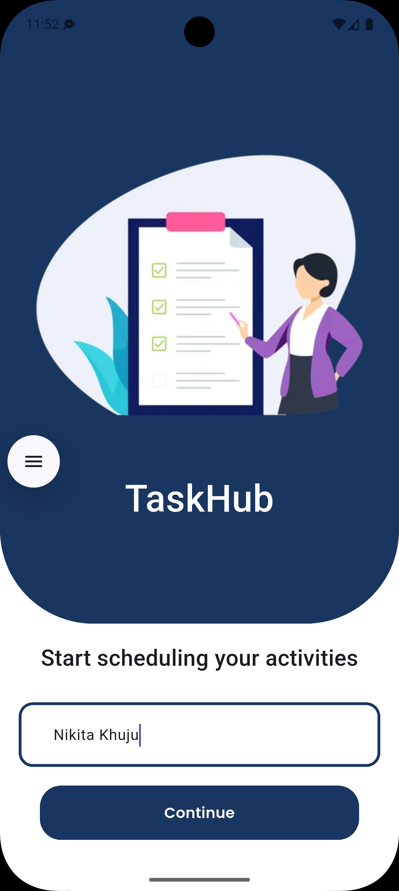
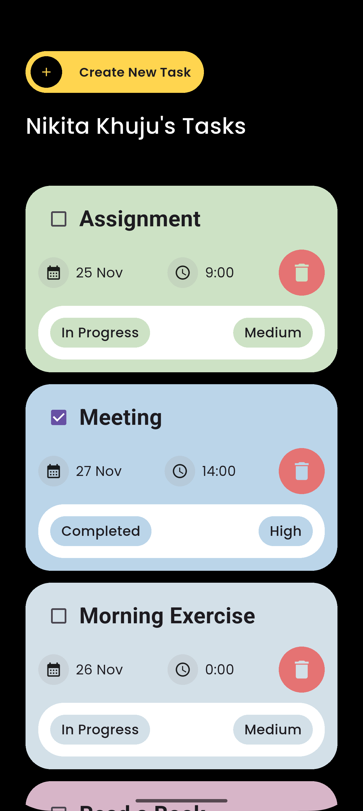
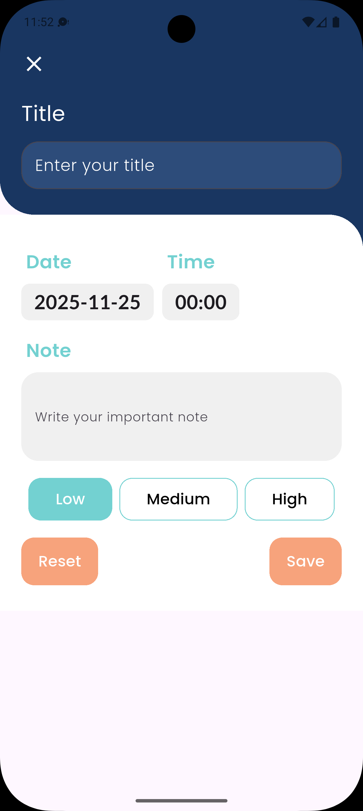
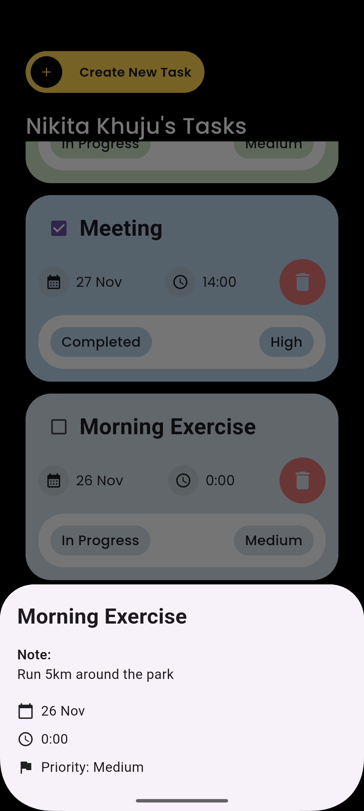
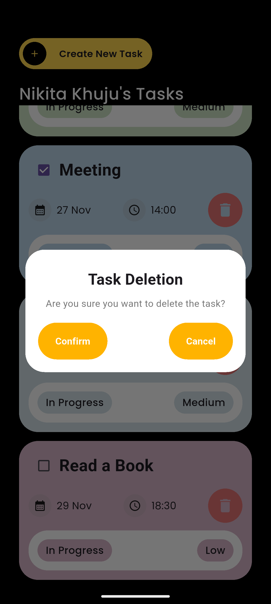

## 📅 TaskHub

TaskHub is a cross-platform task scheduling application built with Flutter to simplify daily organization and help you manage personal and professional projects efficiently.It provides a clean, distraction-free environment for tracking all your tasks across devices.

---

### 📸 App Display
<div style="display: flex; gap: 20px; flex-wrap: wrap; justify-content: center; align-items: center;">
  
  
  
  
  
</div>


---

### ✨ Key Features

TaskHub is designed with usability in mind. Here’s what you can currently do:

- **Quick Task Creation:** Add new tasks instantly.
- **Due Dates & Priorities:** Assign deadlines and priority levels (High, Medium, Low).
- **Visual Status Tracking:** Mark tasks as completed and monitor your daily progress.
- **Cross-Platform Support:** Built on Flutter, TaskHub provides a consistent experience on mobile, desktop, and web.

---

### 🛠️ Tech Stack

- **Framework:** **Flutter**
- **Language:** **Dart**
---

### 🚀 Getting Started

To get a local copy of TaskHub up and running on your machine, follow these steps.

#### Prerequisites

- **Flutter SDK:** Make sure you have the latest stable version of Flutter installed.
  - You can check your installation with: `flutter doctor`
- **Dart SDK:** Included with Flutter.

#### Installation

1.  **Clone the repository:**

    ```bash
    git clone https://https://github.com/NikitaKhuju/TaskHub.git
    cd TaskHub
    ```

2.  **Install dependencies:**

    ```bash
    flutter pub get
    ```

3.  **Run the application:**
    Start a device emulator or connect a physical device, and then run:

    ```bash
    flutter run
    ```

    To run on a specific platform (e.g., web), use:

    ```bash
    flutter run -d web
    ```

---

### 🤝 Contributing

Contributions are what make the open-source community such a fantastic place to learn, inspire, and create. Any contributions you make are **greatly appreciated**.

1.  **Fork** the Project.
2.  Create your Feature Branch (`git checkout -b feature/AmazingFeature`).
3.  Commit your Changes (`git commit -m 'feat: Add some AmazingFeature'`).
4.  Push to the Branch (`git push origin feature/AmazingFeature`).
5.  Open a **Pull Request**.

---

### 📜 License

Distributed under the MIT License. See `LICENSE` for more information.

---
